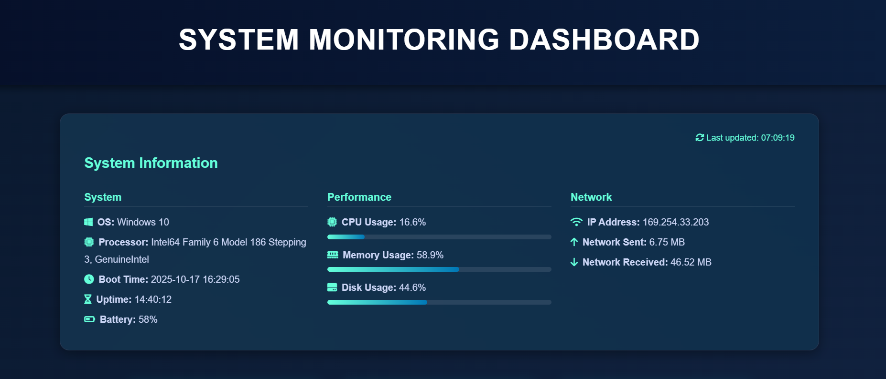
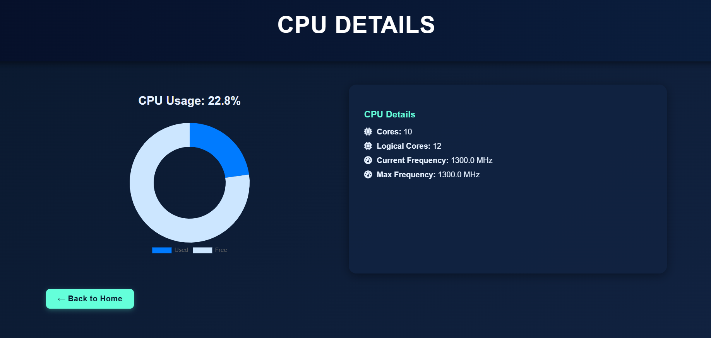
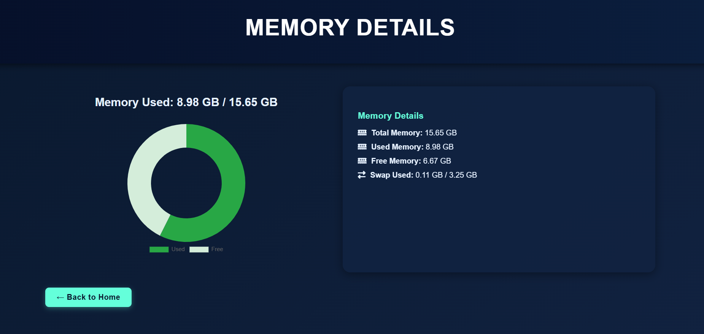
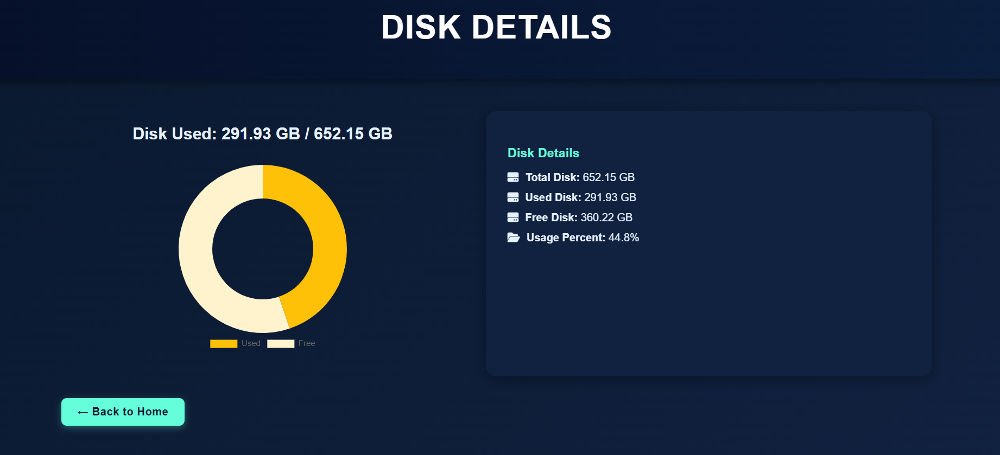

# 🖥️ System Monitoring Dashboard (Flask + psutil)

A **web-based real-time system monitoring dashboard** built with **Flask** and **psutil**.  
It visually presents system metrics — including CPU, Memory, Disk, Network, and System Information — through an interactive and modern web interface.  

This project was created as part of a **Virtual Machine Provisioning and Monitoring** task, to understand how system-level metrics can be collected and presented in real time.

---

## 🧩 Overview

The **System Monitoring Dashboard** is a lightweight web application that provides live insights into system performance using Python.  
It continuously gathers system data through the `psutil` library and displays it using Flask’s templating engine with **Chart.js** visualizations.  

You can monitor:
- CPU utilization  
- Memory usage  
- Disk performance  
- Network activity  
- Uptime and system specifications  

This project mimics the behavior of a **VM monitoring panel**, commonly seen in cloud or DevOps tools.

---

## 🚀 Features

### 🧠 System Information
- OS name and version  
- Processor and architecture details  
- System uptime since boot  
- IP address and battery status  

### ⚙️ CPU Monitoring
- Real-time CPU usage percentage  
- Logical vs. physical core count  
- CPU frequency (current, min, max)  
- Graphical representation with doughnut charts  

### 💾 Memory Insights
- Total, used, and available RAM  
- Swap memory usage  
- Visualized with responsive progress bars  

### 💽 Disk Usage
- Total, used, and free storage  
- Disk usage percentage with live visualization  

### 🌐 Network Statistics
- IP address and bandwidth usage  
- Data sent and received in MB  

### 🎨 Interactive Web Interface
- Responsive HTML/CSS with glowing borders  
- Smooth animations using CSS transitions  
- Chart.js for real-time data visualization  
- Navigation cards for each monitoring section  

---

## 🧱 System Architecture

```text
+---------------------------+
|       User Browser        |
|  (HTML/CSS + Chart.js UI) |
+------------+--------------+
             |
             v
+---------------------------+
|         Flask App         |
|  (Python + Jinja2 Server) |
+------------+--------------+
             |
             v
+---------------------------+
|        psutil API         |
| (System-level monitoring) |
+---------------------------+
```

**Flow:**  
User → Flask → psutil → Flask (render HTML) → Browser (Chart.js visualization)

---

## 🧰 Technologies Used

| Category | Technology |
|-----------|-------------|
| Backend Framework | Flask |
| System Monitoring | psutil |
| Frontend Visualization | Chart.js |
| Styling | HTML5, CSS3 (custom + FontAwesome) |
| Language | Python 3 |
| Deployment | Localhost / Cloud VM |

---

## 🗂️ Project Structure

```
SystemMonitoringDashboard/
│
├── app.py                # Main Flask application
├── requirements.txt      # Project dependencies
└── README.md             # Documentation file
```

**requirements.txt**
```
Flask
psutil
```

---

## ⚙️ Installation & Setup

### 1. Clone the repository
```bash
git clone https://github.com/yourusername/system-monitoring-dashboard.git
cd system-monitoring-dashboard
```

### 2. Create a virtual environment (recommended)
```bash
python -m venv venv
venv\Scripts\activate        # For Windows
source venv/bin/activate       # For Linux/Mac
```

### 3. Install dependencies
```bash
pip install -r requirements.txt
```

### 4. Run the application
```bash
python app.py
```

### 5. Access the dashboard
Open your browser and visit 👉 **http://127.0.0.1:5000/**

---

## ⚙️ How It Works

1. The Flask backend calls **psutil** to fetch system data:
   - CPU percent, cores, frequency  
   - Memory and disk stats  
   - Network bytes sent/received  
   - Boot time, uptime, and IP  
2. Flask passes this data to HTML templates using `render_template_string()`.  
3. The UI renders the metrics as **animated progress bars and charts** using **Chart.js**.  
4. Pages auto-refresh dynamically when reloaded, always showing updated system metrics.

---

## 🌐 Routes

| Route | Description |
|-------|-------------|
| `/` | Home Dashboard — shows overview of all system stats |
| `/cpu` | CPU page — detailed CPU usage with chart |
| `/memory` | Memory page — shows RAM & swap usage |
| `/disk` | Disk page — total, used, and free space |

---

## 🖼️ Screenshots

## 🖼️ Screenshots

| Dashboard | CPU Details | Memory Details | Disk Details |
|------------|--------------|----------------|---------------|
|  |  |  |  |


---

## 🚧 Future Enhancements

- 🔄 Auto-refresh every few seconds  
- 📊 Add GPU usage monitoring  
- 🌐 Add system temperature and fan speed  
- ☁️ Deploy on AWS / Render / PythonAnywhere  
- 📱 Mobile-responsive layout improvements  

---

## 🎯 Learning Outcomes

Through this project, you learn:
- How to use **psutil** to collect real-time system metrics  
- Building Flask routes and dynamic templates  
- Integrating **Chart.js** with Flask for visual dashboards  
- Structuring a clean, deployable Python project  
- Writing professional documentation for GitHub  

---

## 📜 License

This project is licensed under the **MIT License**.  
You’re free to use, modify, and distribute it with proper attribution.

---

⭐ **If you found this project useful, give it a star on GitHub!**
